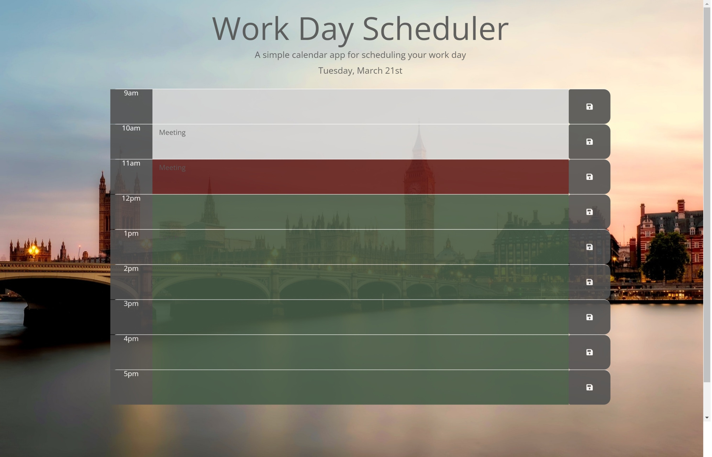

# 07-work-day-scheduler

## Description

This repo contains all files related to the week 7 challenge. I decided to build the work day scheduler to enable me to practise using JQuery and moments JS to solve a real world problem. The application allows users to add calendar entries, which persist between refreshes, and formats entries according to whether they are in the present, future or past. This application also displays the current day at the top of the page. This project enabled me to apply JQuery, and moment JS and further practise using local storage and the set interval method. It also exposed me to some of the challenges of working with dates in different formats and reminded me that string comparisons do not deliver the desired results.

## Installation

N/A

## Usage

This work day scheduler has been set up to enable users to plan and manage their day.

Please see below for a screenshot of the scheduler.

Please refer to the link below to access the webpage:

[Work Day Scheduler website](https://nwinch1512.github.io/07-work-day-scheduler/ "Visit Work Day Scheduler website")

## Credits

JQuery and moment JS were utilised to complete this project.

## License

Please refer to the LICENSE in the repo.
